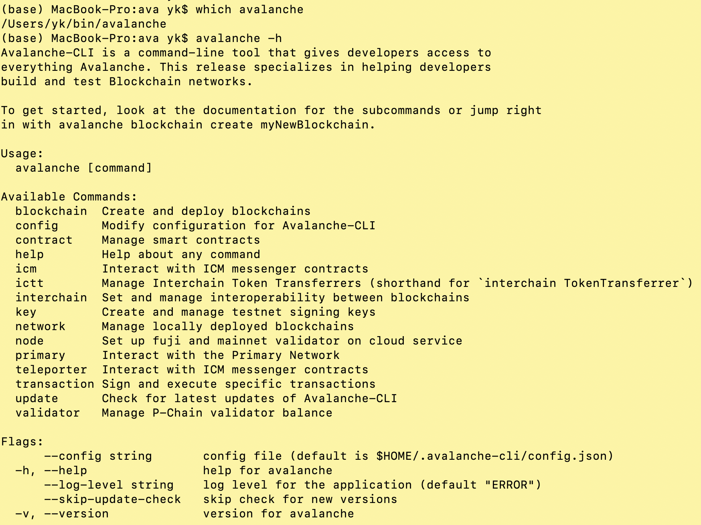
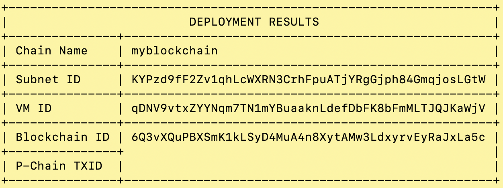
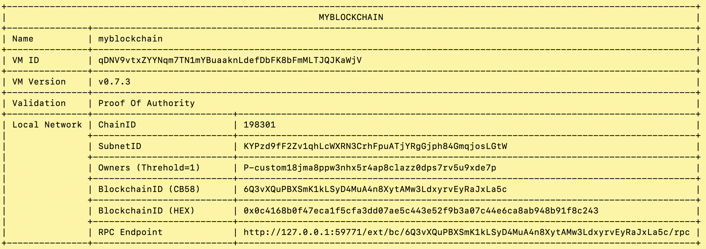
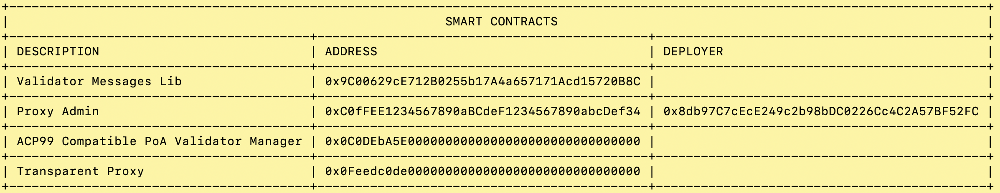
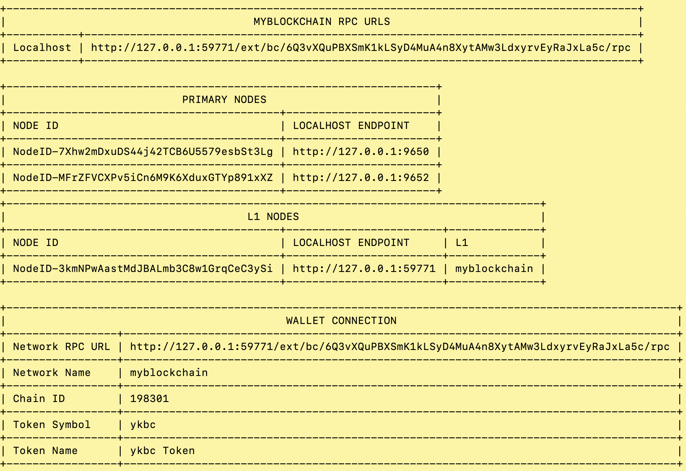
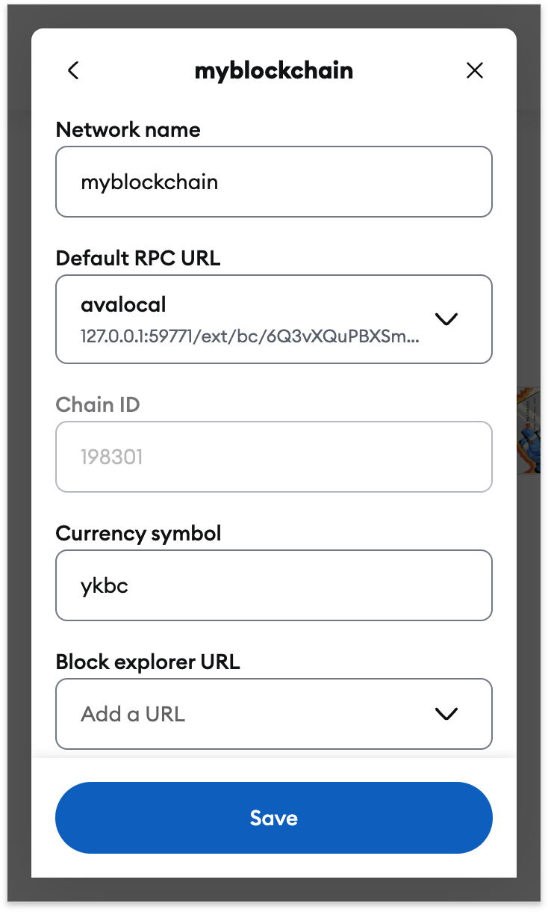

# AvalancheL1Interact
本项目介绍如何部署Avalanche L1，并且与其交互。

## 安装 

参考教程：https://build.avax.network/docs/tooling/get-avalanche-cli

下载安装脚本并执行：

```sh
curl -sSfL https://raw.githubusercontent.com/ava-labs/avalanche-cli/main/scripts/install.sh | sh -s
```

该脚本默认会将avalanche安装到~/bin($HOME/bin)，执行效果如下：

```sh
$ curl -sSfL https://raw.githubusercontent.com/ava-labs/avalanche-cli/main/scripts/install.sh | sh -s
ava-labs/avalanche-cli info checking GitHub for latest tag
ava-labs/avalanche-cli info found version: 1.8.10 for darwin/arm64
ava-labs/avalanche-cli info installed /Users/yk/bin/avalanche
warning: brew bash-completion package not found. avalanche command completion for bash not installed
```

如果`~/bin`不在PATH中，需要手动配置一下环境变量。

```sh
export PATH=~/bin:$PATH >> .bashrc
```

重启终端，或使用`source .bashrc`命令使其生效。

可以通过`avalanche -h`验证安装效果，如下图所示。




##配置（创建）

avalance关于链的基本使用方式如下，subcommand属于子命令。

```sh
avalanche blockchain [subcommand] [flags]
```

使用`avalanche blockchain create myblockchain`创建一个L1链，myblockchain属于自定义名字，可以修改。执行效果如下所示。

```sh
$ avalanche blockchain create myblockchain
✔ Subnet-EVM
✔ Proof Of Authority
✔ Get address from an existing stored key (created from avalanche key create or avalanche key import)
✔ ewoq
✓ Validator Manager Contract owner address 0x8db97C7cEcE249c2b98bDC0226Cc4C2A57BF52FC
✔ I want to use defaults for a test environment
Chain ID: 198301
Token Symbol: ykbc
prefunding address 0x8db97C7cEcE249c2b98bDC0226Cc4C2A57BF52FC with balance 1000000000000000000000000
Installing subnet-evm-v0.7.3...
subnet-evm-v0.7.3 installation successful
File /Users/yk/.avalanche-cli/subnets/myblockchain/chain.json successfully written
✓ Successfully created blockchain configuration
Run 'avalanche blockchain describe' to view all created addresses and what their roles are
```

这里面包含了相关的配置信息，例如ChainID，Token名称，初始化的账户，以及使用的VM等。


## 启动L1

使用如下命令部署L1到本地，myblockchain与前面的配置一致。

```sh
avalanche blockchain deploy myblockchain --local
```

若干的部署结果如下：


基础配置信息：








这里面的rpc，chainid，token等也是配置metamask的关键信息。

## metamask配置

根据前面的部署情况，在此处添加metamask的网络配置。



需要将ewoq地址对应的私钥导入到metamask，这样初始化钱包账户就持有了ykbc的这个token。

相关交互的智能合约在contracts目录下。

## video

视频链接：https://www.youtube.com/watch?v=a1noZo8xeko

